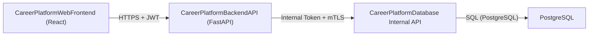

# Architecture

## Executive Summary and Scope
The MVP enables a single-step career journey (e.g., Chief Architect to CTO) using curated roles, a shared competency model with proficiency levels, adjacency analysis for alternative roles, and generation of a development plan. Out of scope for MVP: resume parsing, LinkedIn integration, rich coaching content, HR enablement, payments. Personas: technology leaders (primary), admins (template/audit oversight).

## System Architecture (Three-Container View)
- CareerPlatformWebFrontend (React): UI for role selection, assessment, gap analysis, and plan viewing/export. Uses JWT to authenticate with backend.
- CareerPlatformBackendAPI (FastAPI): Business logic, API orchestration, security and audit logging. Sole access to the database/internal data API.
- CareerPlatformDatabase (PostgreSQL): Canonical storage for users, roles, competencies, mappings, results, templates, audit, and traceability.

### Mermaid Diagram (High-Level)

## Data Flow and Security Layers
- FE → BE: HTTPS with Bearer JWT. CORS enabled at backend. No direct DB access from FE.
- BE → DB: Calls internal data access API with X-Internal-Token and mTLS. The DB service persists to PostgreSQL. All data operations audited.
- Logging: Request/response metadata and actions logged with traceId. Sensitive data minimized and redacted.
- Compliance: Controls-as-code mindset for authZ, input validation, evidence capture (audit logs, traceability).

## Logging and Observability
- Backend logs: structured logs with request id, user id, action, outcome, latency, and error details.
- Audit logs: persisted via internal API for CRUD and analysis actions. Admins can view via dedicated endpoints.
- Health: “/” health check (200). Future: add /healthz and /readyz.

## Non-Functional Considerations
- Availability and resilience aligned with MVP scope.
- Performance: use pagination for lists (roles, competencies). Cache static lookups in-process where appropriate.
- Security: least privilege; JWT validation; internal token and mTLS to DB; PII minimized and never logged.
