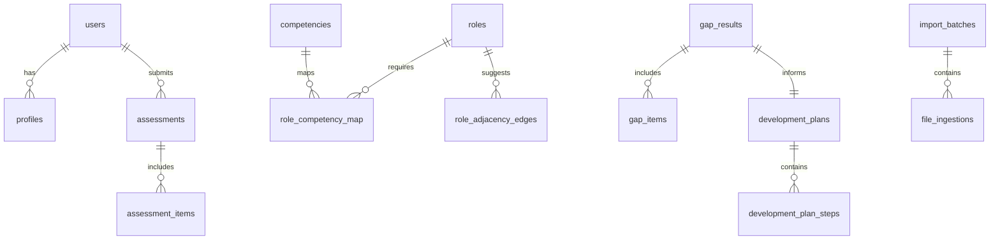

# Backend Modules and Schema

## Overview
This document details the backend service modules for the MVP Career Platform and a proposed data model to support the MVP scope: a single-step journey (for example, Chief Architect to CTO), gap analysis, development plan generation, and alternative role suggestions via adjacency. It also introduces the proficiency scale and Excel-to-entity mappings that anchor the canonical data.

## Service Modules
### Authentication and Identity
Handles JWT issuance and validation. Provides login, logout, register, and optional reset-password endpoints.

### Profile
Stores the user’s working context for the journey, including current role, target role, and a working set of competencies with self-assessed proficiency.

### Roles and Competencies
Serves curated roles and the canonical competency model. Roles are associated to competencies with required proficiency bands.

### Gap Analysis
Computes difference between current competencies and the target role’s required levels, producing a structured GapAnalysisResult (including machine-friendly data to drive graph visualizations).

### Development Plan
Transforms the gap analysis into a development plan with concrete actions and export support.

### Role Adjacency
Offers alternative roles and rationale based on competency overlap/adjacency matrices.

### Templates and Admin
Manages templates (e.g., sponsor brief or plan sections) and lists audit logs for administrators.

### Audit and Traceability
Creates immutable audit records for each write and preserves traceability back to source files (Excel workbooks for roles/competencies/adjacency and navigator worksheet).

### Import/Ingestion
Parses Excel workbooks to seed or update canonical entities and mappings. Creates import batches and per-file ingestion records with validation outcomes.

## Proficiency Scale and Ranges
- Levels: F (Foundational), P (Practitioner), A (Advanced), Au (Authority/Board-level)
- Ranges: P–A means min = P, max = A; A–Au means min = A, max = Au

The MVP database model stores proficiency either as:
- a single level (F|P|A|Au), or
- a range (min_level, max_level) to capture P–A and A–Au.
For internal APIs, return both a normalized single “requiredLevel” (e.g., take max_level) and the original min/max to preserve fidelity.

## Proposed Entity-Relationship (Narrative)
- users(id, email, name, …)
- profiles(id, user_id FK→users.id, current_role_id FK→roles.id, target_role_id FK→roles.id, updated_at)
- roles(id, name, description, version, source)
- competencies(id, name, definition)
- role_competency_map(role_id FK→roles.id, competency_id FK→competencies.id, required_min_level, required_max_level)
- assessments(id, user_id FK→users.id, created_at)
- assessment_items(assessment_id FK→assessments.id, competency_id FK→competencies.id, level)
- gap_results(id, user_id FK→users.id, target_role_id FK→roles.id, created_at)
- gap_items(gap_result_id FK→gap_results.id, competency_id FK→competencies.id, current_level, required_min_level, required_max_level)
- development_plans(id, gap_result_id FK→gap_results.id, created_at, export_link)
- development_plan_steps(plan_id FK→development_plans.id, sequence, description, action_type, resource)
- role_adjacency_edges(from_role_id FK→roles.id, to_role_id FK→roles.id, weight, rationale)
- templates(id, name, content, metadata)
- audit_logs(id, timestamp, user_id, action, entity_type, entity_id, details JSONB)
- import_batches(id, created_at, source, notes)
- file_ingestions(id, batch_id FK→import_batches.id, file_path, checksum, status, errors JSONB, row_count)
- traceability(entity_type, entity_id, source_documents [])

### Mermaid ERD (proposed)

## Keys and Indexing
- roles(id PK, UNIQUE(name, version))
- competencies(id PK, UNIQUE(name))
- role_competency_map(PK: role_id, competency_id); INDEX(role_id), INDEX(competency_id)
- role_adjacency_edges(PK: from_role_id, to_role_id); INDEX(weight)
- assessments(PK: id), assessment_items(PK: assessment_id, competency_id)
- gap_results(PK: id), INDEX(user_id, target_role_id, created_at DESC)
- gap_items(PK: gap_result_id, competency_id)
- development_plans(PK: id), development_plan_steps(PK: plan_id, sequence)
- audit_logs(PK: id), INDEX(timestamp DESC), INDEX(entity_type, entity_id)
- import_batches(PK: id), file_ingestions(PK: id, INDEX(batch_id), INDEX(status))

## Excel Anchors and Mappings
The following Excel sources are canonical and must be traceable for each imported row:

### Competency_mapping.xlsx (wide format)
- Headers (excerpt): “Competency”, “CA”, “CTO”, “BU CIO”, “CSO”, “COO”, “CoS”, “GSSO”, “CPO”, “CISO”, “CIO”, “CPTO”, “CDO”, “CTrO”, “CInO”, “CDAO”, “CAIO”, “PMO”, “AppDev”, “Infra”, “Ops”, “DigProd”, “FCTO”, “CCTO”, “VE”, “CP”
- Example cells: “Strategy-to-Capability” → CTO = “A”; “Enterprise Architecture” → CA = “A”, CTO = “P–A”
- Transformation: For each row, pivot columns into role_competency_map with required_min_level and required_max_level (e.g., “P–A” → min=P, max=A).

### CA_Role_Adjacency.xlsx (gaps/overlap basis)
- Rows enumerate target role, canonical competency, and “Gap (levels)” values (e.g., “Executive/board storytelling (internal)” gap 1 from A to Au).
- Use the overlap method: per-competency overlap = min(level_i, level_j)/max(level_i, level_j); overall overlap = mean across mutual competencies. Persist as role_adjacency_edges.weight and retain rationale text.

### Role_Navigator_Worksheet.xlsx (personalization inputs)
- Columns: Interest (1–5), Overlap with Chief Architect (%), Sponsorship Strength (0–5), Readiness Runway (months), Risk/Regulatory Fit (0–5), Market Pull (0–5), Scope Appetite Fit (0–5), Notes/Evidence links.
- Store inputs in a user-scoped profile extension or a session table if needed for the MVP; do not store PII beyond necessity.

## Notes
- Backend APIs must include traceability metadata on read/write to enable admins to see which source documents and batch IDs informed a given entity or mapping.
- For ranges (P–A, A–Au), prefer preserving both min and max in the DB while exposing a normalized requiredLevel to clients for simplicity.
